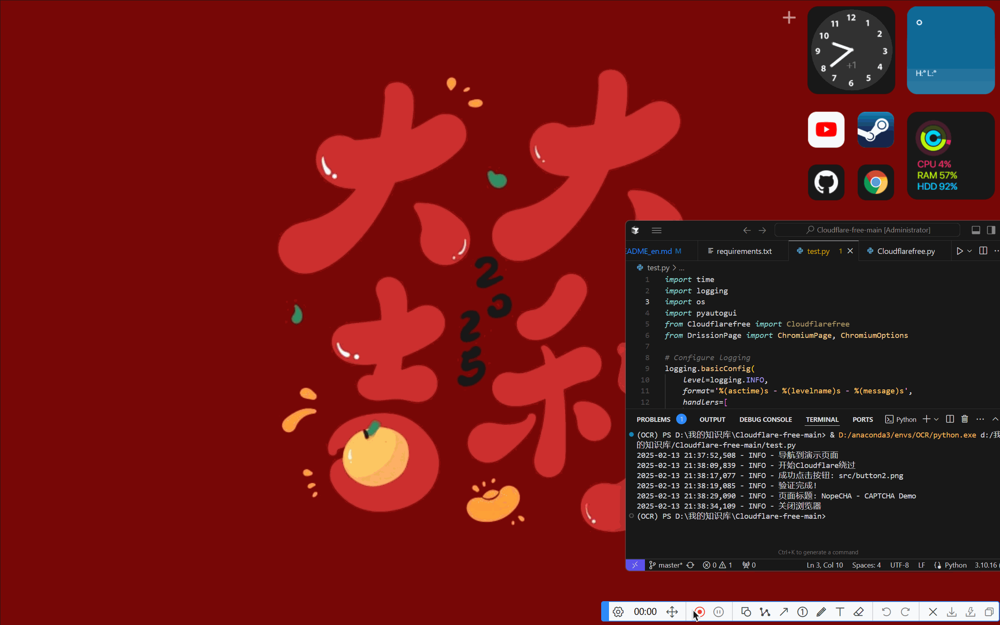

# Cloudflare-free


#### 我的社交账号


 Twitter:@momonogikana_mg

# 使用说明

##### 初始化 conda for PowerShell
```bash
conda init powershell
```


##### 创建新环境
```bash
conda create --name Cloudflare python=3.10.16 -y
```


##### 激活环境
```bash
conda activate Cloudflare
```


##### 依赖安装
```bash
pip install -r requirements.txt
```


##### 运行项目
```bash
python test.py
```

# 效果展示



# 赞助支持


1. 🖥️现在加入雨云立即领取首月5折新人优惠,内含大量免备案极速三网服务器  
<a href="https://www.rainyun.com/NTk2ODI2_" class="rainyun-link">点击这里</a>访问雨云官网。

2. 🚀能够白嫖的科学上网<a href="https://goen.win/sti9so" class="rainyun-link">快速访问</a>

3. ✅满血deepseekr1-api<a href="deepseekr1-apihttps://cloud.siliconflow.cn/i/k8KRWTyU" class="rainyun-link">快速访问</a>

# 提供技术援助
1.希望大神们告诉我使用无头模式，有什么方法能成功绕过验证，


这个问题AI也解决不了，仓库我都翻烂了（如果有米，我早就用API了）


# ☕宝宝肚肚打雷了，给我点个外卖吧！！！


####收货地址
```bash
0xa7b63e868aa22074a93c230f277f519dfcb0e1af
```


#### 义父们的封神榜
| ID | 金额 |
|------|------|
| null | 100 |
| null | 100 |
| null | 6.66 |
