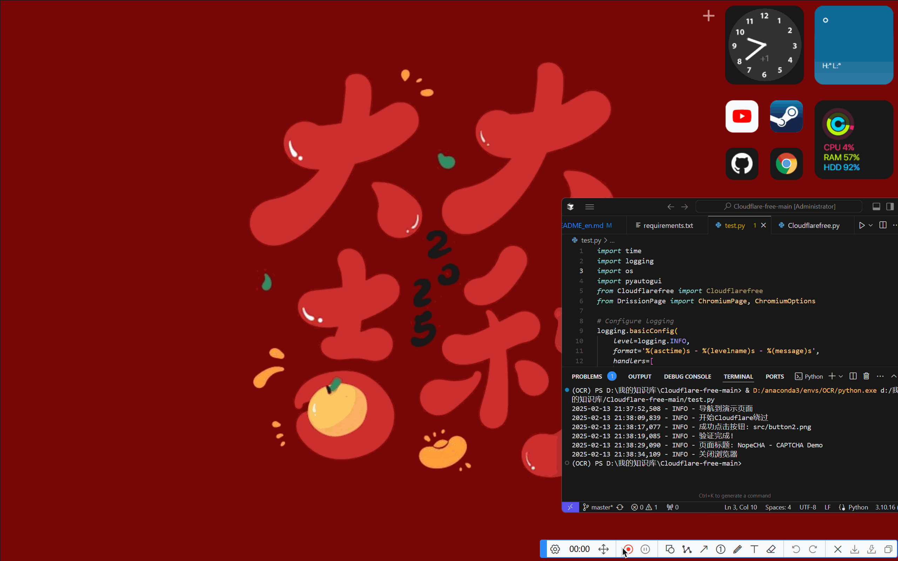

# Cloudflare-free

A tool to bypass Cloudflare protection.

#### Social Media
Twitter: @momonogikana_mg

# Getting Started

##### Initialize conda for PowerShell
```bash
conda init powershell
```

##### Create New Environment
```bash
conda create --name Cloudflare python=3.10.16 -y
```

##### Activate Environment
```bash
conda activate Cloudflare
```

##### Install Dependencies
```bash
pip install -r requirements.txt
```

##### Run Project
```bash
python test.py
```

# Demo


# Support & Sponsorship

1. 🖥️ Join Rainyun Cloud now to get 50% off for your first month! Featuring high-speed servers with no ICP filing required.  
<a href="https://www.rainyun.com/NTk2ODI2_" class="rainyun-link">Click here</a> to visit Rainyun.

2. 🚀 Free VPN Service: <a href="https://goen.win/sti9so" class="rainyun-link">Quick Access</a>

3. ✅ Full-powered Deepseek R1 API: <a href="deepseekr1-apihttps://cloud.siliconflow.cn/i/k8KRWTyU" class="rainyun-link">Quick Access</a>


# Provide technical assistance
1. I hope the experts can tell me how to successfully bypass the verification when using headless mode.


AI can't solve this problem either. I have searched the warehouse thoroughly (if I had rice, I would have used API long ago)

# Buy Me a Coffee ☕

#### Wallet Address
```bash
0xa7b63e868aa22074a93c230f277f519dfcb0e1af
```


#### Hall of Fame
| ID | Amount |
|------|------|
| null | 100 |
| null | 100 |
| null | 6.66 |

## License
This project is licensed under the MIT License - see the [LICENSE](LICENSE) file for details.
